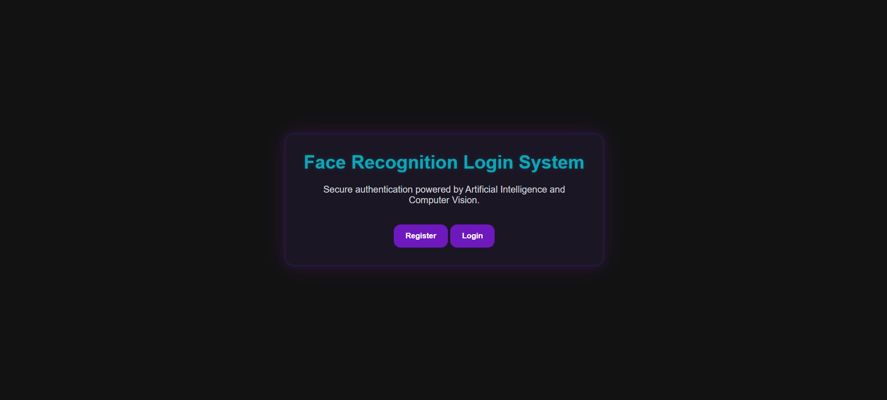

# Face Recognition Login System

A biometric authentication system that replaces traditional password-based login with facial recognition. Users can register and log in using their face through a webcam-powered Flask application.

---

## Overview

This project demonstrates how computer vision can be used for user authentication. Instead of entering passwords, users authenticate using facial recognition. Facial features are converted into 128-dimensional face encodings and stored in a SQLite database for future verification.

The application is built using Flask, OpenCV, Dlib, and the Face Recognition library, providing a complete end-to-end face authentication workflow.

---

## Features

- Face-based user registration
- Face-based login authentication
- 128-dimensional facial encoding generation
- Facial encoding storage using SQLite
- Session-based authentication using Flask
- Protected dashboard access
- Duplicate username prevention
- Real-time webcam integration using OpenCV
- Modern dark-themed UI with custom purple and cyan styling
- Error handling and user feedback messages

---

## Tech Stack

### Backend
- Python
- Flask
- SQLite

### Computer Vision & AI
- OpenCV
- Face Recognition
- Dlib
- NumPy

### Frontend
- HTML
- CSS
- JavaScript

---

## How Authentication Works

1. Capture an image from the webcam.
2. Detect the face using the Face Recognition library.
3. Generate a 128-dimensional facial encoding.
4. Store the encoding in SQLite during registration.
5. During login, generate a new encoding from the webcam image.
6. Compare the new encoding against stored encodings.
7. If a match is found within the similarity threshold, authentication is granted.

---

## System Workflow

### Registration

User → Webcam → Face Detection → Face Encoding → SQLite Database

### Login

User → Webcam → Face Detection → Face Encoding → Database Comparison → Authentication Result

---

## Database Schema

### Table: users

| Field | Type |
|---------|---------|
| id | INTEGER |
| username | TEXT |
| face_encoding | TEXT |

---

## Project Screenshots

### Home Page



### Registration Page


### Login Page


### Dashboard


---

## Project Structure

```text
FaceLoginSystem/
│
├── app.py
├── requirements.txt
├── README.md
│
├── database/
│   ├── db_operations.py
│   ├── init_db.py
│   └── users.db
│
├── face_module/
│   ├── __init__.py
│   ├── camera_test.py
│   ├── face_detection.py
│   ├── face_utils.py
│   ├── login_face.py
│   └── register_face.py
│
├── static/
│   ├── css/
│   │   └── style.css
│   ├── images/
│   │   ├── home.png
│   │   ├── register.png
│   │   ├── login.png
│   │   └── dashboard.png
│   └── js/
│       └── script.js
│
├── templates/
│   ├── index.html
│   ├── register.html
│   ├── login.html
│   └── dashboard.html
│
└── captured_faces/
```

---

## Prerequisites

- Python 3.9 or higher
- Webcam
- Internet connection for installing dependencies

---

## Installation

### Clone Repository

```bash
git clone https://github.com/AryaBhongade/face-recognition-login-system.git
cd face-recognition-login-system
```

### Create Virtual Environment

```bash
python -m venv venv
```

### Activate Virtual Environment

#### Windows

```bash
venv\Scripts\activate
```

#### Linux / macOS

```bash
source venv/bin/activate
```

### Install Dependencies

```bash
pip install -r requirements.txt
```

---

## Run the Application

Initialize the database:

```bash
python database/init_db.py
```

Start the Flask server:

```bash
python app.py
```

Open the application in your browser:

```text
http://127.0.0.1:5000
```

---

## Usage

### Register

1. Open the Register page.
2. Enter a username.
3. Click **Register With Face**.
4. Press **C** in the webcam window.
5. The facial encoding is generated and stored in the database.

### Login

1. Open the Login page.
2. Click **Login With Face**.
3. Press **C** in the webcam window.
4. The facial encoding is compared with stored encodings.
5. If a match is found, access is granted.

---

## Future Improvements

- Multiple face samples per user
- Face re-registration support
- Liveness detection (anti-spoofing)
- Improved face matching accuracy
- Admin dashboard
- Face mask support

---

## Disclaimer

This project was developed for educational purposes to demonstrate biometric authentication using computer vision techniques.

It is not intended for production use without additional security measures such as liveness detection, encryption, anti-spoofing protection, and advanced security controls.

---

## Author

**Arya Bhongade**

LinkedIn: https://www.linkedin.com/in/arya-bhongade

GitHub: https://github.com/AryaBhongade